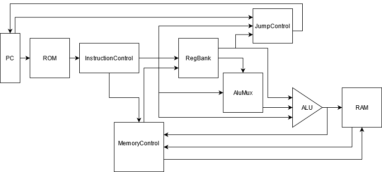

# WeirdProcessor
This is the first step of my LSC project to build a full computational system.

## Diagram

## Usage
Architecture is describe on DOCUMENTATION.md, and was developed only with simulations without using a FPGA Hardware.

The processor runs the code on rom_instruction_file.txt, you may have the simulation result using Processor_tb.v

## To do
* Implement a better I/O interface;
* Make a simulation in FPGA Hardware; 
